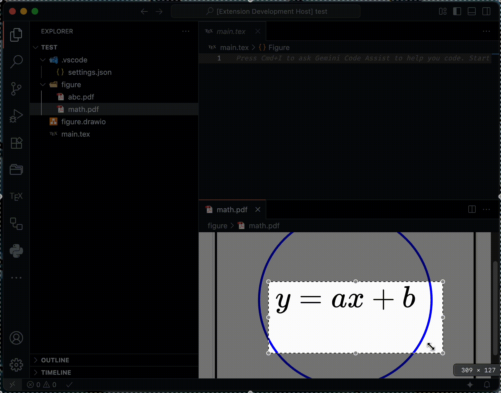

  
  <h1>LaTeX Graphics Helper</h1>

|[English](README.md)|日本語|

LaTeX ユーザー向けの VS Code 拡張機能で、グラフィックファイルを効率的に処理します。PDF のトリミング、画像形式の変換、Draw.io ファイルの PDF 変換、Gemini AI を使用した LaTeX コード生成などの機能を提供します。

- [Visual Studio Code Marketplace](https://marketplace.visualstudio.com/items?itemName=naatin777.latex-graphics-helper)
- [Open VSX](https://open-vsx.org/extension/naatin777/latex-graphics-helper)

## デモ

<table>
  <tr>
    <td></td>
    <td></td>
  </tr>
  <tr>
    <td></td>
    <td></td>
  </tr>
</table>

## 機能

-   **PDF トリミング**: 選択した PDF ファイルの余白を自動的にトリミングします。
-   **PDF 分割**: 選択した PDF ファイルを複数の単一ページ PDF ファイルに分割します。
-   **PDF 結合**: 複数の選択した PDF ファイルを 1 つの PDF ファイルに結合します。
-   **Draw.io を PDF に変換**: 選択した Draw.io ファイル (.drawio または .dio) を PDF に変換します。各タブが別々の PDF ファイルとしてエクスポートされます。
-   **PDF を画像に変換**: pdftocairo を使用して選択した PDF ファイルを PNG、JPEG、または SVG 形式に変換します。
-   **画像を PDF に変換**: inkscape を使用して選択した PNG、JPEG、または SVG ファイルを PDF 形式に変換します。
-   **PDF の LaTeX 挿入**: PDF ファイルを LaTeX ドキュメントにドラッグアンドドロップして、対応する LaTeX コードを自動的に挿入します。
-   **Gemini AI で LaTeX コード生成**: Gemini AI を使用して画像から LaTeX コード（数式、表など）を生成します。

## 要件

-   PDF トリミング機能を使用するには、システムに pdfcrop がインストールされている必要があります。通常 TeX Live または MiKTeX に含まれています。
-   Draw.io を PDF に変換する機能を使用するには、システムに Draw.io デスクトップアプリケーションがインストールされている必要があります。
-   PDF を画像に変換する機能を使用するには、システムに pdftocairo がインストールされている必要があります。通常 Poppler ユーティリティに含まれています。
-   画像を PDF に変換する機能を使用するには、システムに Inkscape がインストールされている必要があります。
-   Gemini AI 機能を使用するには、Gemini API キーが必要です。[Google AI Studio](https://aistudio.google.com/app/apikey) から取得できます。
