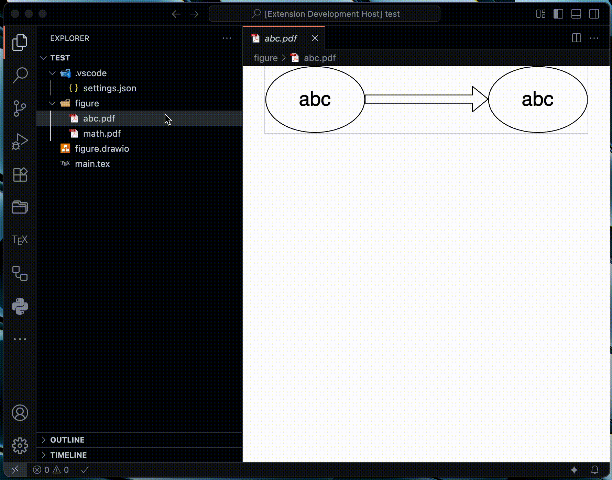
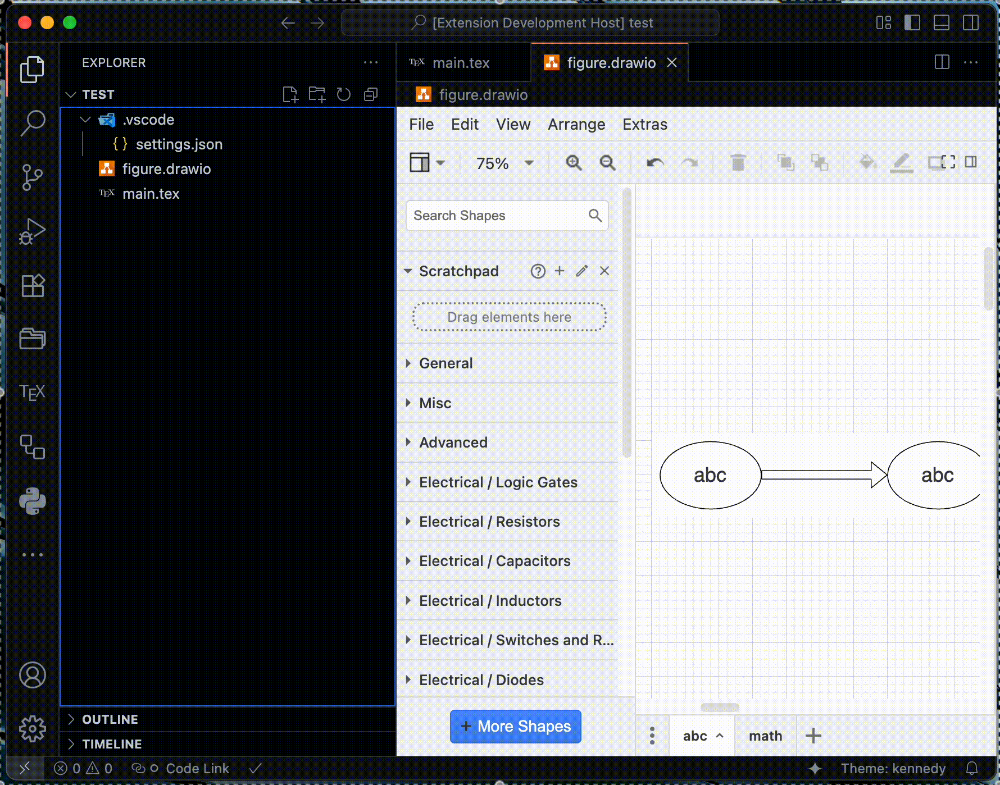
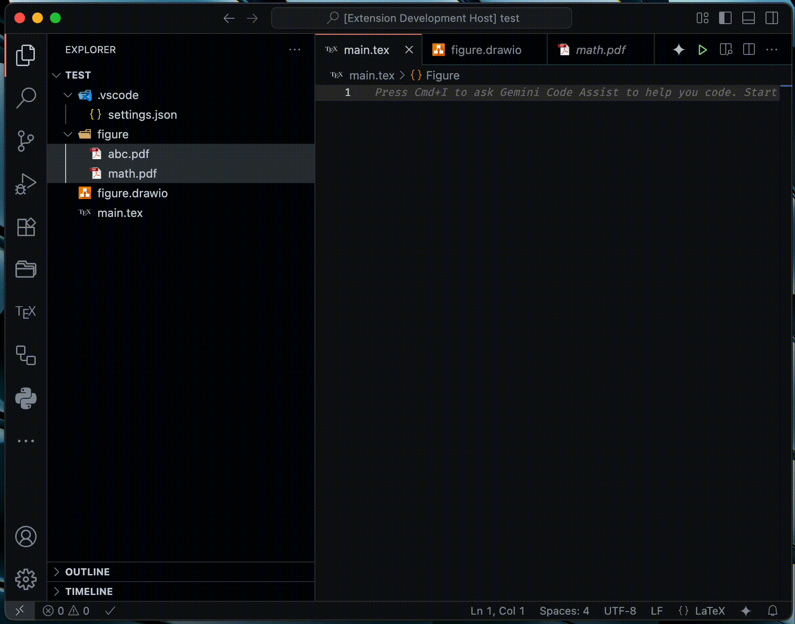
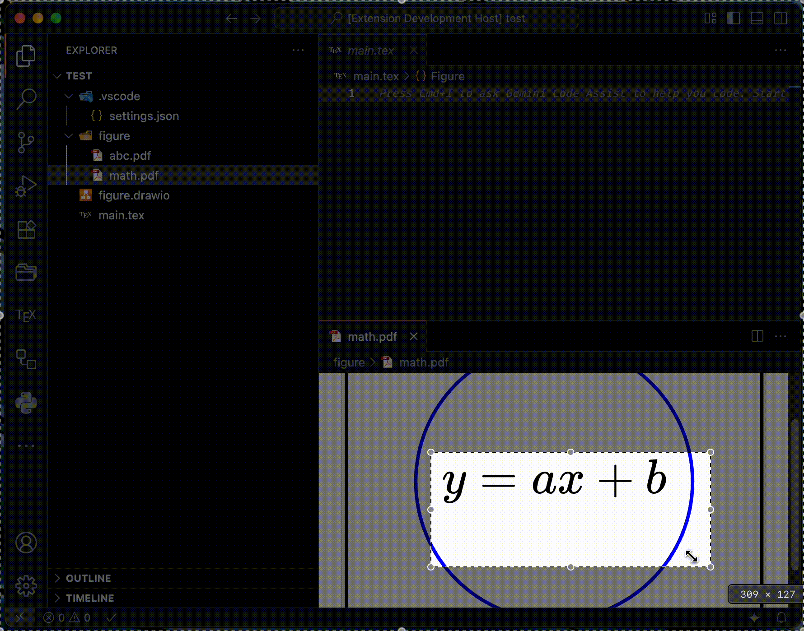

# LaTeX Graphics Helper

A VS Code extension for LaTeX users to efficiently process graphic files. It provides features such as PDF cropping, image format conversion, converting Draw\.io files to PDF, and generating LaTeX code using Gemini AI.

- [Visual Studio Code Marketplace](https://marketplace.visualstudio.com/items?itemName=naatin777.latex-graphics-helper)
- [Open VSX](https://open-vsx.org/extension/naatin777/latex-graphics-helper)

## Demonstration

<table>
  <tr>
    <td></td>
    <td></td>
  </tr>
  <tr>
    <td></td>
    <td></td>
  </tr>
</table>

## Features

-   **Crop PDF**: Automatically crops the margins of selected PDF files.
-   **Split PDF**: Splits a selected PDF file into multiple single-page PDF files.
-   **Merge PDF**: Merges multiple selected PDF files into a single PDF file.
-   **Convert Draw\.io to PDF**: Converts selected Draw\.io files (.drawio or .dio) to PDF. Each tab is exported as a separate PDF file.
-   **Convert PDF to Image**: Converts selected PDF files to PNG, JPEG, or SVG format using pdftocairo.
-   **Convert Image to PDF**: Converts selected PNG, JPEG, or SVG files to PDF format using inkscape.
-   **Insert LaTeX for PDF**: Drag and drop PDF files into your LaTeX document to automatically insert the corresponding LaTeX code.
-   **Generate LaTeX Code with Gemini AI**: Generate LaTeX code (equations, tables, etc.) from images using Gemini AI.

## Requirements

-   To use the PDF cropping feature, pdfcrop must be installed on your system. It is typically included with TeX Live or MiKTeX.
-   To use the Draw\.io to PDF conversion feature, the Draw\.io desktop application must be installed on your system.
-   To use the PDF to Image conversion features, pdftocairo must be installed on your system. It is typically included with Poppler utilities.
-   To use the Image to PDF conversion features, Inkscape must be installed on your system.
-   To use the Gemini AI features, you need a Gemini API key. You can obtain one from [Google AI Studio](https://aistudio.google.com/app/apikey).
