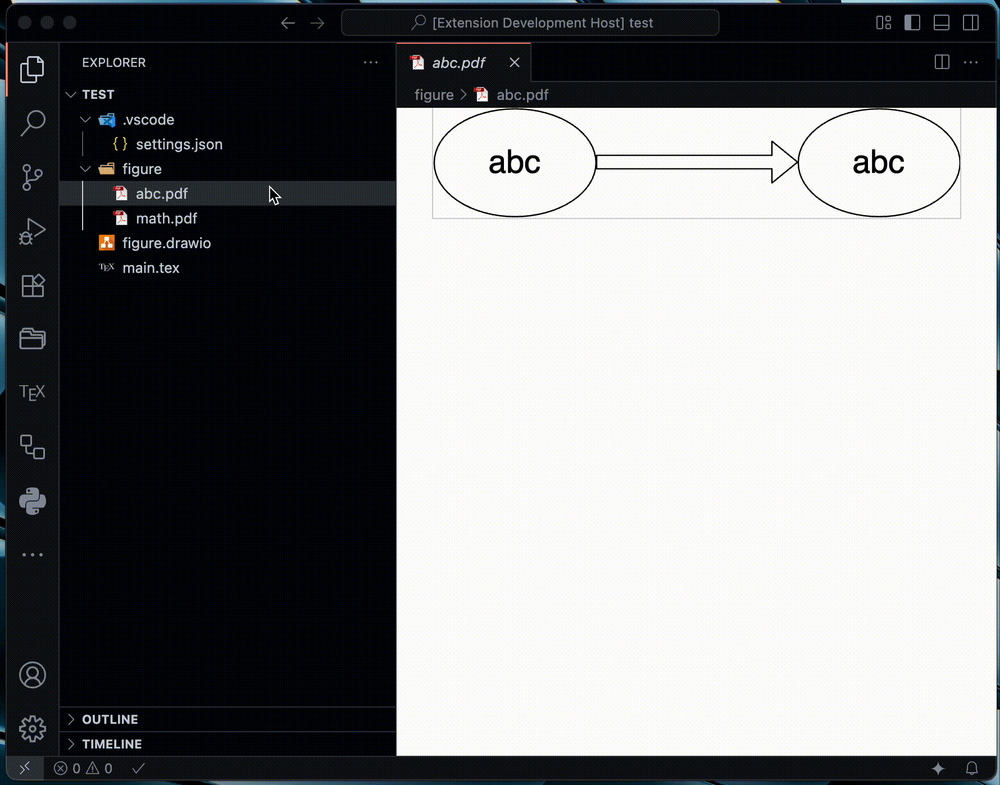
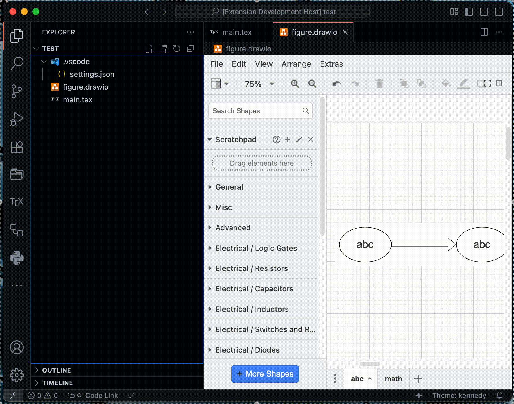
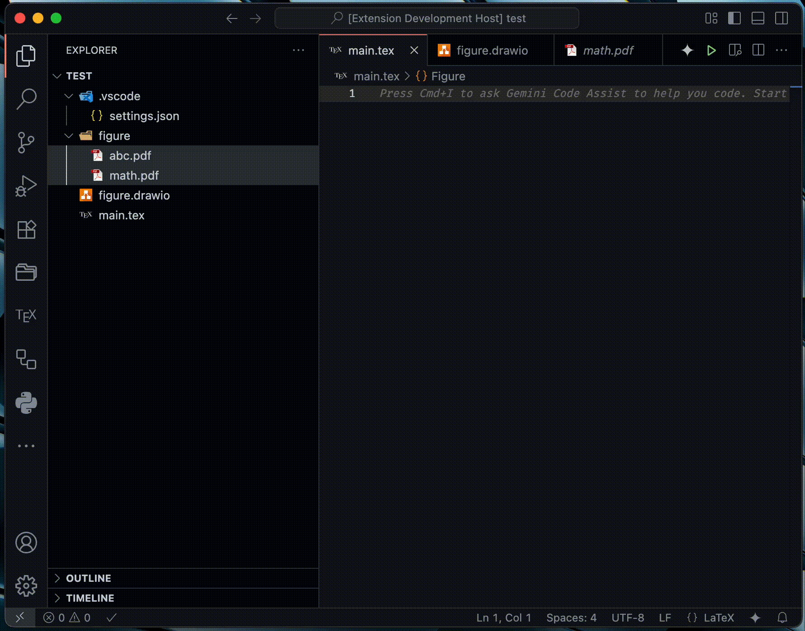
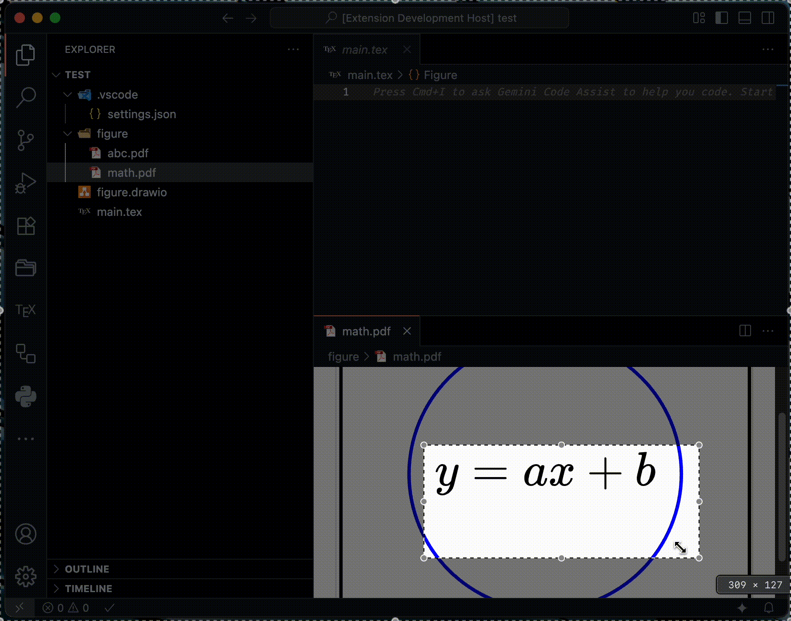

  
  <h1>LaTeX Graphics Helper</h1>
  
  

English | [日本語](README.ja.md)

This is an extension designed to intuitively handle PDF and image files within VS Code.
It offers a variety of features, including PDF merging, splitting, and trimming, mutual conversion of image formats, and PDF conversion of Draw.io files.

## Demo

<table>
  <tr>
    <td></td>
    <td></td>
  </tr>
  <tr>
    <td></td>
    <td></td>
  </tr>
</table>

## Features

### PDF Operations
*   **Crop**: Crops the margins of the selected PDF file.
*   **Split**: Splits the selected PDF file into single-page PDFs.
*   **Merge**: Merges multiple selected PDF files into one.
*   **Convert to Image**: Converts PDF files to PNG, JPEG, or SVG format.

### Image & Draw.io Operations
*   **Convert to PDF**: Converts PNG, JPEG, or SVG files to PDF format.
*   **Convert Draw.io to PDF**: Converts Draw.io files (.drawio, .dio) to PDF. Each tab is exported as a separate PDF.

### LaTeX Code Generation
*   **Insert from PDF**: Drag and drop a PDF file into a LaTeX document to automatically insert the corresponding LaTeX code.
*   **Insert from Image**: Paste an image from the clipboard into LaTeX to automatically insert the LaTeX code and save the image file.

## Installation

You can install this extension in one of the following ways:

*   **Visual Studio Code Marketplace**:
    Search for "LaTeX Graphics Helper" in the Extensions Marketplace within VS Code and install it.
    [Visual Studio Code Marketplace](https://marketplace.visualstudio.com/items?itemName=naatin777.latex-graphics-helper)

*   **Open VSX Registry**:
    It can also be installed from Open VSX, an alternative marketplace for VS Code.
    [Open VSX](https://open-vsx.org/extension/naatin777/latex-graphics-helper)

## Required Tools

*   **Draw.io**: The Draw.io desktop application is required to convert Draw.io files (.drawio, .dio) to PDF. Download it from [Draw.io](https://github.com/jgraph/drawio-desktop/releases).
*   **pdfcrop**: The PDF cropping feature requires pdfcrop. It is usually included with TeX Live or MiKTeX.
*   **pdftocairo**: The feature to convert PDFs to images requires pdftocairo. It is usually included with Poppler utilities.
*   **rsvg-convert**: SVG to PDF conversion requires rsvg-convert (from [librsvg](https://wiki.gnome.org/Projects/LibRsvg)). On macOS: `brew install librsvg`. On Debian/Ubuntu: `apt install librsvg2-bin`.

## Configuration

*   **`latex-graphics-helper.pasteClipboardImageAs`**: How clipboard images are pasted into LaTeX. `ask` (default) shows a picker for PDF vs image; `pdf` or `image` skips the picker.
*   **Output channel**: Open **View → Output → LaTeX Graphics Helper** to see command execution, batch progress, and errors logged by the extension.
